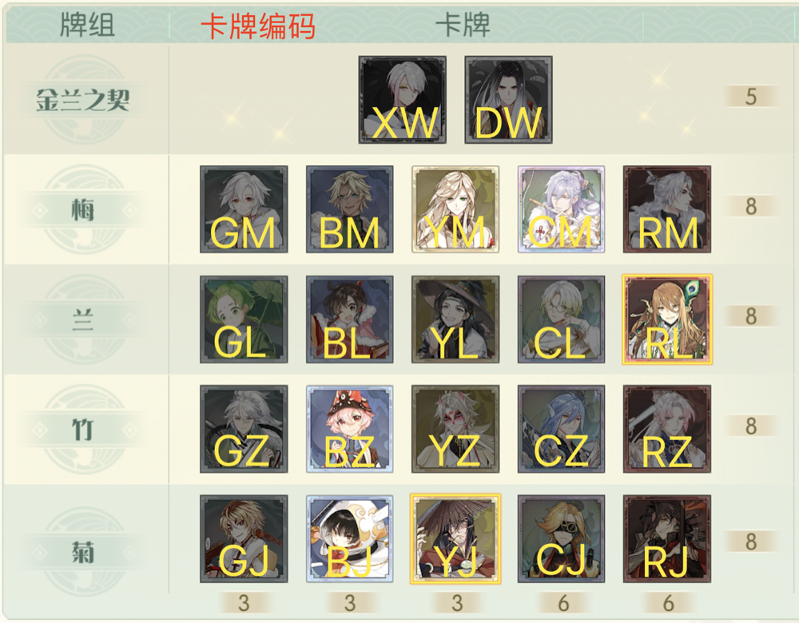

# 食物语“摆龙门”游戏AI代打

  

本程序改编自[RLCard](https://rlcard.org)框架。有关如何使用、版本依赖等详细信息请参考他们的[官方源代码](https://github.com/datamllab/rlcard)。

## 免责声明

本程序仅用于学习与交流，任何超出此范围的使用所导致的全部后果将由使用者本人承担。选择使用本程序，表明您已无条件同意接受以上条款。为避免本程序的恶意使用破坏游戏平衡，本站将不提供预训练模型权重等支持文件。说人话就是，如果你AI代打被封号了，不关我事。

## 游戏简介

略（详见[这里](https://www.9game.cn/news/4192674.html)和[这里](https://www.bilibili.com/read/cv4972337)）。

## 方法

我们学习并改编了[RLCard](https://rlcard.org)中斗地主AI的代码。这个游戏的状态空间、每局的路径长度等远远小于斗地主，所以实现起来相对容易一些。我们也因此调小了网络结构。[rlcard/envs/bailongmen.py](rlcard/envs/bailongmen.py)中实现了本游戏的模拟环境。[rlcard/games/bailongmen/game.py](rlcard/games/bailongmen/game.py)实现了本游戏相关的过程逻辑。[rlcard/agents](rlcard/agents)文件夹内为需要用到的agents，包括用于训练的 AI agent（目前只尝试了 Deep Monte Carlo）和用于评估的 [random agent](rlcard/agents/random_agent.py), [rule-based agent](rlcard/agents/rule_based_agent.py)，以及用于模拟人机对战的[human agent](rlcard/agents/human_agent.py)。

### 编码
**卡牌编码**：一共22张卡牌。颜色：灰G、蓝B、黄Y、彩C、红R，花色：梅M、兰L、竹Z、菊J。如“彩梅”为“CM”。大王与小王分别为DW, XW。具体如下图所示。

**动作编码**：卡牌编码 + 区域（0-打入私有区，1-打入公有区）。比如，"CM1"表示将“彩梅”牌打入公有区。

### 状态特征空间

某一个回合的状态特征由以下几部分观测信息组成：系统初始公有牌(board_public)、己方公有牌(cur_public)、己方私有牌(cur_private)、对方公有牌(oppo_public)、己方手牌(cur_hand)、己方剩余公有空间(cur_public_space)、己方剩余私有空间(cur_private_space)、对方剩余公有空间(oppo_public_space)、对方剩余私有空间(oppo_private_space)。除了以上必备信息外，我们又设计了以下特征来帮助学习：己方各花色数量(cur_suit_count, cur_joker_count)、己方各颜色数量(cur_color_count)、对方各花色数量(oppo_suit_count, oppo_joker_count)、对方各颜色数量(oppo_color_count)。由于本游戏的状态相对离散，我们 one-hot 编码了以上这些特征。最终状态特征为230维。

### 动作特征空间

每次动作出一张牌。一共22张牌，要么打入公有区，要么打入私有区，所以全局动作空间(action space)大小为22x2=44。每种动作用一个44维 one-hot 编码表示。每次出牌时，我们只考虑合法动作空间(legal action space)，从中选取价值 $V(s, a)$ 最高的动作。

### 奖励函数

每局游戏打完是12个回合，为一个 trajectory。每个 trajectory 的奖励函数为己方净胜分（即己方最终得分减去对方最终得分）。

### 其他细节
- 类似斗地主中训练了三个模型分别用于地主、地主下家的农民和地主上家的农民，我们这里也训练了两个模型，分别用于先手和后手。我们让先手模型与后手模型对战来生成训练数据。
- 类似斗地主AI，我们采用了多进程实时生成训练数据放入公共内存，多线程从内存中读训练数据来调整网络。
- Epsilon-Greedy: exploration rate=0.01.

## Agents

### AI Agents

#### Version 1.0: (--ai_agent dmc --model_path results/dmc_swy_1.0/bailongmen/model.tar)
方法：Deep Monte Carlo with 4-layer MLP [256,256,256,128] (--cuda 0,1 --num_actor_devices 1 --training_device 1 --num_actors 8 --total_iterations 300000)
- 对战random agent的情况（基于5000场的模拟对局）：
    - 先手：胜91.1%，负5.6%，平3.3%。平均每局净胜5.75分。
    - 后手：胜92.1%，负4.8%，平3.1%。平均每局净胜5.92分。
- 对战rule-based agent的情况（基于5000场的模拟对局）：
    - 先手：胜63.3%，负28.2%，平8.5%。平均每局净胜1.88分。
    - 后手：胜68.1%，负22.8%，平9.9%。平均每局净胜2.47分。
- 对战游戏内官方AI（“鱼香肉丝”）的情况：手动10场对局中，8胜、1负、1平。
- 对战作者本人（expert human agent）的情况：手动10场对局中，6胜、3负、1平。

### Baseline agents

#### Random agent
每次采取随机动作的agent，用于与训练模型对战来评估当前模型强度。

#### Rule-based agent
采取一个由熟悉该游戏的专家（也就是我本人哈哈）编写的规则（一连串if语句）来选取动作。例如，一个比较常见的规则是：当手牌中同时有大小王时，先将一张放入己方私有区再将另一张放入公有区是比较好的策略。对于规则没有覆盖到的场景，算法对当前每一张手牌打分（基于与当前已有牌同花色、同颜色的情况）来选择出牌动作。

- Rule-based agent 对战 Random agent的情况（基于1000场的模拟对局）：
    - 先手：胜81.5%，负12.6%，平5.9%。平均每局净胜4.56分。
    - 后手：胜84.7%，负11.2%，平4.1%。平均每局净胜4.94分。

